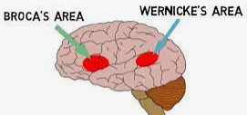
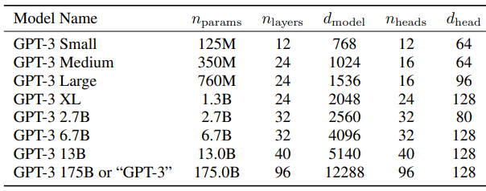
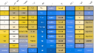
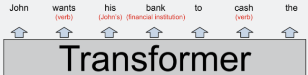
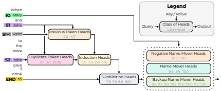

# Intro

From writing poetry to giving medical advice, [large language models](https://en.wikipedia.org/wiki/Large_language_model) are shockingly general,
giving us a first hint of the G in [artificial general intelligence](https://en.wikipedia.org/wiki/Artificial_general_intelligence).
They are also [surprisingly simple](https://dugas.ch/artificial_curiosity/GPT_architecture.html),
and yet deeply opaque, due to their immense size and monolithic nature.

# Timeline

[GPT-2](https://en.wikipedia.org/wiki/GPT-2), [GPT-3](https://en.wikipedia.org/wiki/GPT-3), 

# Weaknesses

As [Dan Piponi](https://mathstodon.xyz/@dpiponi/111116694861297725) noted:

> more has been written about what ChatGPT can't do than has been written about what any other tool can't do. It's all very strange.

Here are some weaknesses:

+ The inability to tell if they are [telling the truth](https://en.wikipedia.org/wiki/Hallucination_(artificial_intelligence)).  They never know when to shut up!

+ Anything requiring precision (like we might expect from, say, a database).

+ The huge amount of training data.  The biggest models consume, maybe, a trillion words, unlike a ten-year-old child, who sees or hears about a hundred million words.  Sam Altman says that [as models get smarter they might need less data](https://youtu.be/byYlC2cagLw?t=784).

+ They only match a small part of the human brain.  We often equate language and intelligence, and therefore LLMs might not be as smart as they seem.

[Wolfram](https://writings.stephenwolfram.com/2023/02/what-is-chatgpt-doing-and-why-does-it-work/) highlights another major gap:

> But try to give it rules for an actual “deep” computation that involves many potentially computationally irreducible steps
> and it just won’t work. (Remember that at each step it’s always just “feeding data forward” in its network,
> never looping except by virtue of generating new tokens.)

> Of course, the network can learn the answer to specific “irreducible” computations.
> But as soon as there are combinatorial numbers of possibilities, no such “table-lookup-style” approach will work.

# Scale

The [GPT-3](https://arxiv.org/abs/2005.14165) paper has this:

The last row shows that the full GPT-3 has 175 billion parameters, arranged in 96 blocks
where each block has an attention layer with 4 * 12288 * 12288 parameters
and a couple of feed forward layers with a further 8 * 12288 * 12288 parameters.

The parameter count doesn't depend on the context window size (which, for GPT-3, is 2048),
or the number of attention heads, or the vocabulary size (which, for GPT-3, is 50,257).
Instead, it just depends on the number of layers and the model dimension (the embedding size of each token).

According to [this](https://github.com/amirgholami/ai_and_memory_wall#nlp-models), GPT-3 needs 740 teraflops to infer a single token,
due to each parameter being used many times (which, in turn, allows the model to do more computation than the raw parameter count would imply).
Later versions of GPT-3 had lower inference costs (?).

In the paper, they say:

>  for most tasks we find relatively smooth scaling with model capacity

and then, intriguingly:

> the gap between zero-, one-, and few-shot performance often grows with model capacity,
> perhaps suggesting that larger models are more proficient meta-learners

# Interpreting GPT

[interpreting GPT: the logit lens](https://www.lesswrong.com/posts/AcKRB8wDpdaN6v6ru/interpreting-gpt-the-logit-lens) - Also see the "Mentioned in" section at the end.

[A jargon-free explanation of how AI large language models work](https://arstechnica.com/science/2023/07/a-jargon-free-explanation-of-how-ai-large-language-models-work/)
 - including the brilliant squirrels analogy for how NNs are trained

[Interpretability in the Wild: a Circuit for Indirect Object Identification in GPT-2 small](https://arxiv.org/abs/2211.00593)

[Transformer Feed-Forward Layers Are Key-Value Memories](https://arxiv.org/abs/2012.14913)

[A Mechanism for Solving Relational Tasks in Transformer Language Models](https://arxiv.org/abs/2305.16130) - e.g., capital_of(Poland)=Warsaw

[A Mathematical Framework for Transformer Circuits](https://transformer-circuits.pub/2021/framework/index.html) - Anthropic

[In-context Learning and Induction Heads](https://transformer-circuits.pub/2022/in-context-learning-and-induction-heads/index.html) - Anthropic

# Other Links

The GPT paper? [Improving Language Understanding by Generative Pre-Training](https://s3-us-west-2.amazonaws.com/openai-assets/research-covers/language-unsupervised/language_understanding_paper.pdf)

The GPT-2 paper? [Language Models are Unsupervised Multitask Learners](https://d4mucfpksywv.cloudfront.net/better-language-models/language-models.pdf)

[On the Opportunities and Risks of Foundation Models](https://arxiv.org/abs/2108.07258)
