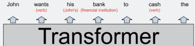

# Intro

From writing poetry to giving medical advice, [large language models](https://en.wikipedia.org/wiki/Large_language_model) are shockingly general,
giving us a first hint of the G in [artificial general intelligence](https://en.wikipedia.org/wiki/Artificial_general_intelligence).
They are also [surprisingly simple](https://dugas.ch/artificial_curiosity/GPT_architecture.html),
and yet deeply opaque, due to their immense size and monolithic nature.

# Weaknesses

As [Dan Piponi](https://mathstodon.xyz/@dpiponi/111116694861297725) noted:

> more has been written about what ChatGPT can't do than has been written about what any other tool can't do. It's all very strange.

and:

> "The problem with citations about ChatGPT is that their authenticity can be difficult to discern" -- Plato

Anyway, here are some weaknesses:

+ They don't know when they are [telling the truth](https://en.wikipedia.org/wiki/Hallucination_(artificial_intelligence)).  They never know when to shut up!

+ They can't do anything requiring precision (like we might expect from, say, a database).

+ They need a huge amount of training data.  The biggest models consume, maybe, a trillion words, unlike a ten-year-old child, who has seen or heard about a hundred million words.

+ They only correspond to a small part of the human brain, and so they may not be as smart as we think.

[Wolfram](https://writings.stephenwolfram.com/2023/02/what-is-chatgpt-doing-and-why-does-it-work/) highlights another major gap:

> But try to give it rules for an actual “deep” computation that involves many potentially computationally irreducible steps
> and it just won’t work. (Remember that at each step it’s always just “feeding data forward” in its network,
> never looping except by virtue of generating new tokens.)

> Of course, the network can learn the answer to specific “irreducible” computations.
> But as soon as there are combinatorial numbers of possibilities, no such “table-lookup-style” approach will work.

# Scale

The GPT-3 paper, [Language Models are Few-Shot Learners](https://arxiv.org/abs/2005.14165), has this:

The last row shows that the full GPT-3 has 175 billion parameters, arranged in 96 blocks
where each block has an attention layer with 4 * 12288 * 12288 parameters
and a couple of feed forward layers with a further 8 * 12288 * 12288 parameters.

The parameter count doesn't depend on the context window size (which, for GPT-3, is 2048),
or the number of attention heads, or the vocabulary size (which, for GPT-3, is 50,257).
Instead, it just depends on the number of layers and the model dimension (the embedding size of each token).

According to [this](https://github.com/amirgholami/ai_and_memory_wall#nlp-models), GPT-3 needs 740 teraflops to infer a single token,
due to each parameter being used many times (which, in turn, allows the model to do more computation than the raw parameter count would imply).
Later versions of GPT-3 had lower inference costs (?).

In the paper, they say:

>  for most tasks we find relatively smooth scaling with model capacity

and then, intriguingly:

> the gap between zero-, one-, and few-shot performance often grows with model capacity,
> perhaps suggesting that larger models are more proficient meta-learners

[Memory bandwidth constraints imply economies of scale in AI inference](https://www.lesswrong.com/posts/cB2Rtnp7DBTpDy3ii/memory-bandwidth-constraints-imply-economies-of-scale-in-ai) -
I hadn't realized how severe the GPU memory problems were. The solution seems to be to favour things like matrix multiply where the computation is O(N^3) and the memory is O(N^2), possibly with tiling to make sure things fit in the cache.

# Overviews

[Why GPT-3 Matters](https://bmk.sh/2020/05/29/GPT-3-A-Brief-Summary/)

[The Difficulties of Text Generation using Autoregressive Language Models: A Brief Overview](https://bmk.sh/2019/10/27/The-Difficulties-of-Text-Generation-with-Autoregressive-Language-Models/)

> While some may criticize the autoregressive formulation because people generally
> don’t write purely autoregressively, there actually are authors who use this sort
> of technique to write *entire* books.

# Interpreting GPT

[Interpreting GPT: the logit lens](https://www.lesswrong.com/posts/AcKRB8wDpdaN6v6ru/interpreting-gpt-the-logit-lens) - Also see the "Mentioned in" section at the end.

[A jargon-free explanation of how AI large language models work](https://arstechnica.com/science/2023/07/a-jargon-free-explanation-of-how-ai-large-language-models-work/)
 - including the brilliant squirrels analogy for how NNs are trained

[Interpretability in the Wild: a Circuit for Indirect Object Identification in GPT-2 small](https://arxiv.org/abs/2211.00593)

[Transformer Feed-Forward Layers Are Key-Value Memories](https://arxiv.org/abs/2012.14913)

[A Mechanism for Solving Relational Tasks in Transformer Language Models](https://arxiv.org/abs/2305.16130) - e.g., capital_of(Poland)=Warsaw

[A Mathematical Framework for Transformer Circuits](https://transformer-circuits.pub/2021/framework/index.html) - Anthropic

[In-context Learning and Induction Heads](https://transformer-circuits.pub/2022/in-context-learning-and-induction-heads/index.html) - Anthropic

[The Scaling Hypothesis](https://gwern.net/scaling-hypothesis)

> GPT-3 has “learned how to learn”: in its endless training on so many gigabytes of text,
> it encounters so many different kinds of text that it had no choice but to learn abstractions.

> This family of phenomena is perhaps driven by neural networks functioning as ensembles
> of many sub-networks.

> It is sufficiently powerful a model that its sub-models can do anything from poetry to arithmetic,
> and it is trained on so much data that those superficial models may do well early on,
> but gradually fall behind more abstract models.

[Beyond Surface Statistics: Scene Representations in a Latent Diffusion Model](https://arxiv.org/abs/2306.05720)

# Brains

In "Thinking, Fast and Slow", it says unexpected words causes a distinctive pattern in brain activity to
start within a fifth of a second.

So, in other words, when we're listening, the brain is continuously running an LLM.

I didn't think neurons were fast enough, and so I googled for things like "brain clock rate" (peak 200 Hz) and "synapse speed" (less than a millisecond), and so maybe there is indeed time for a few dozen neuron layers.

# Training

From the GPT-3 paper, [Language Models are Few-Shot Learners](https://arxiv.org/abs/2005.14165):

> **Datasets used to train GPT-3**. “Weight in training mix” refers to the fraction of examples during training
that are drawn from a given dataset, which we intentionally do not make proportional to the size of the dataset. As a
result, when we train for 300 billion tokens, some datasets are seen up to 3.4 times during training while other datasets
are seen less than once.

# Optimization

[BitNet: Scaling 1-bit Transformers for Large Language Models](https://arxiv.org/abs/2310.11453) -
reduce the FF matrices to 1-bit precision, by using just +1 or -1 values.

[Generating Long Sequences with Sparse Transformers](https://arxiv.org/abs/1904.10509) - sparse factorizations of the attention matrix which reduce the cost to O(n√n).

# Tuning

[Intrinsic Dimensionality Explains the Effectiveness of Language Model Fine-Tuning](https://arxiv.org/abs/2012.13255)

[LoRA: Low-Rank Adaptation of Large Language Models](https://arxiv.org/abs/2106.09685)

# Hallucinations

[Looking for an interpretability paper](https://www.reddit.com/r/mlscaling/comments/175xtbt/looking_for_an_interpretability_paper_that/)

[Chain-of-Verification Reduces Hallucination in Large Language Models](https://arxiv.org/abs/2309.11495)

# Wikipedia links

[GPT-2](https://en.wikipedia.org/wiki/GPT-2), [GPT-3](https://en.wikipedia.org/wiki/GPT-3), 

# Other Links

[Attention Is All You Need](https://arxiv.org/abs/1706.03762)

[Language Models are Unsupervised Multitask Learners](https://d4mucfpksywv.cloudfront.net/better-language-models/language-models.pdf) -
The GPT-2 paper?

[On the Opportunities and Risks of Foundation Models](https://arxiv.org/abs/2108.07258)

[What OpenAI Really Wants](https://www.wired.com/story/what-openai-really-wants/) - A fun history of OpenAI.

# Random thoughts

We can't help equating language ability and intelligence.  Therefore, the LLMs' eloquence might be fooling us into thinking they are smart.

LLMs don't contain control-flow things like "if" statements.

An LLM is like a fuzzy hologram of the web.

# Inbox

[The Bitter Lesson](http://www.incompleteideas.net/IncIdeas/BitterLesson.html)

[Improving Language Understanding by Generative Pre-Training](https://s3-us-west-2.amazonaws.com/openai-assets/research-covers/language-unsupervised/language_understanding_paper.pdf) - The original GPT paper?

[The Curious Case of Neural Text Degeneration](https://arxiv.org/abs/1904.09751)
